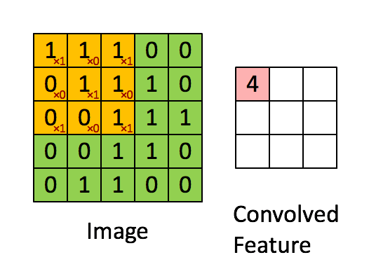
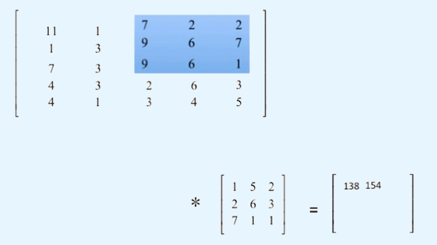
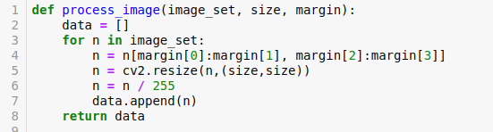
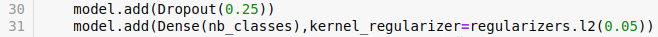
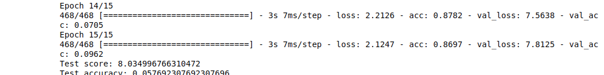
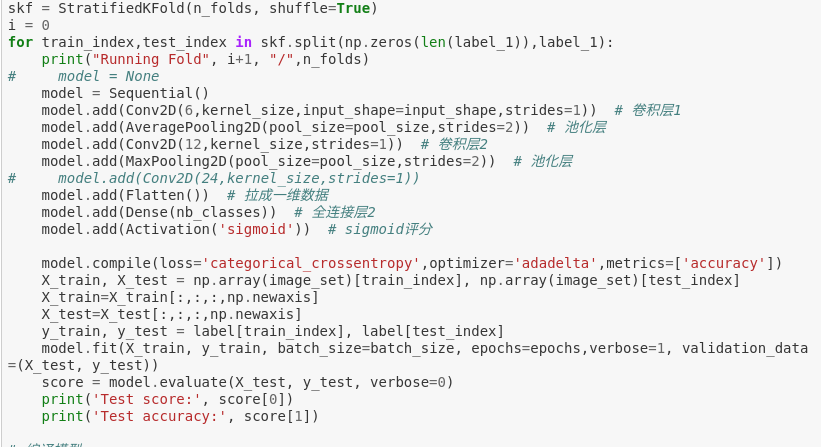
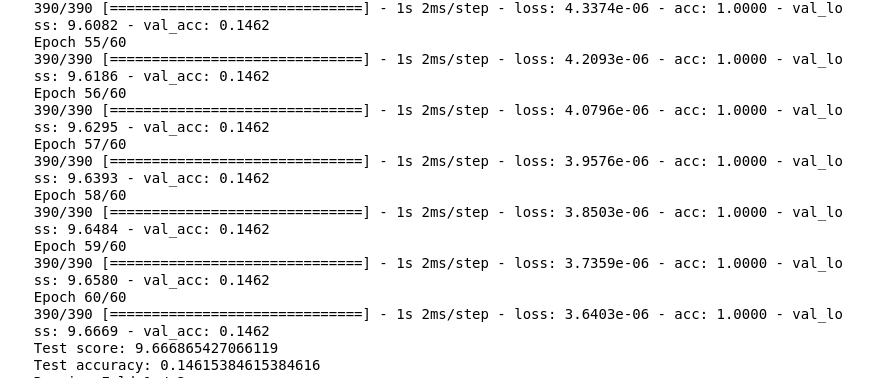
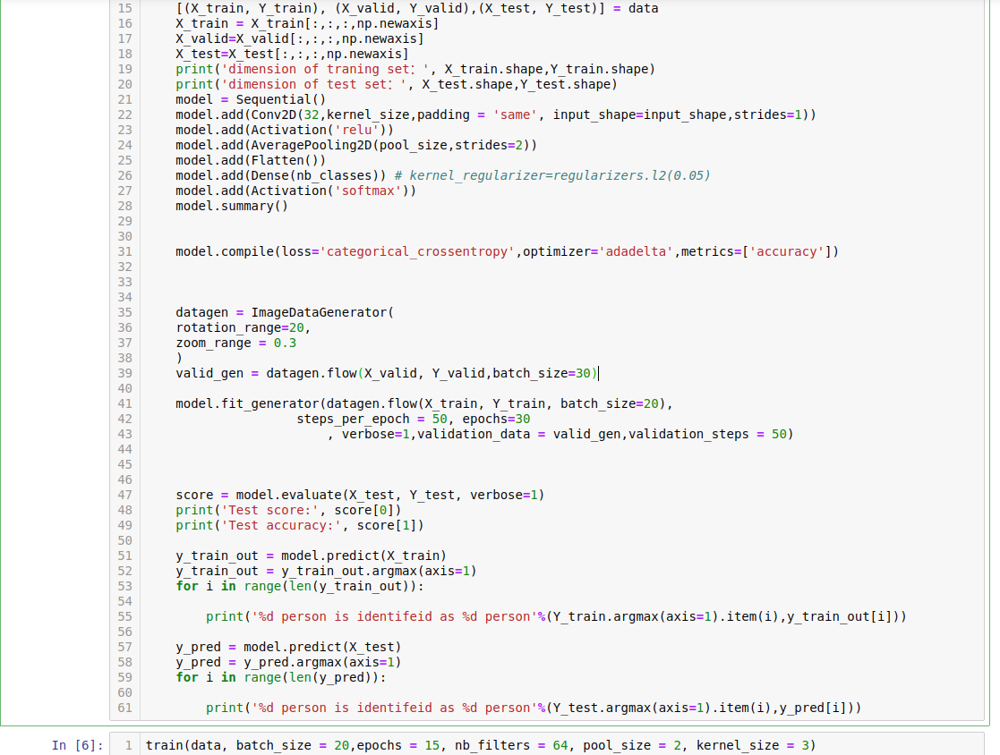
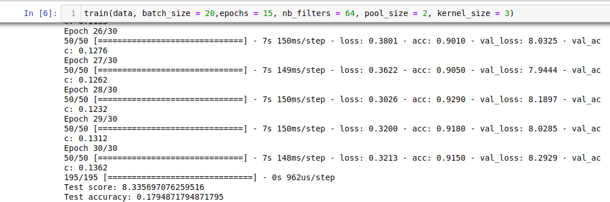
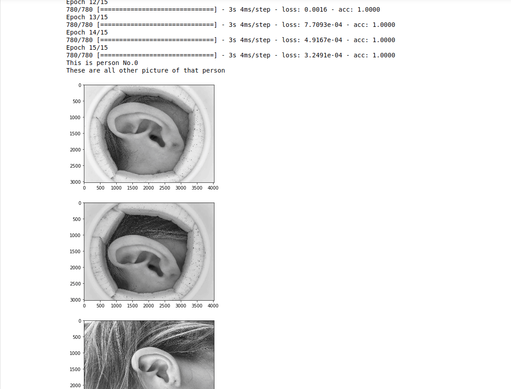

# Project: Ear Recognition
Yifei Feng 

Zehui Jiang 

Guangxing Ren 

# Abstract:
**The process of precisely recognize people by ears has been getting major attention in recent years. It represents an important step in the biometric research, especially as a complement to face recognition systems which have difficult in real conditions. This is due to the great variation in shapes, variable lighting conditions, and the changing profile shape which is a planar representation of a complex object. We present an ear recognition system involving a convolutional neural networks (CNN)  to identify a person given an input image.**


# Identify your problem
In this project, we are given a set of left ear image from people with different identities. For each ear(each person). Four images are given, we for ears “in the wild” (there is no constraint in the way of taking the photo), two for ear images taken with a “donut device” that serves as a background and somewhat controls lighting.  There are 4*195(individual ear) in the dataset. <Br>
    (Data source: http://cs-people.bu.edu/wdqin/earImageDataset.zip)

The term ear biometrics refers to automatic human identification on the basis of the ear physiological (anatomical) features. The identification is performed on the basis of the features which are usually calculated from captured 2D or 3D ear images (using pattern recognition and image processing techniques). 

Being able to identify human ears automatically has a significant meaning. It can be useful in several domains such as:
<li>1. Criminal determination
<li>2. Enfant identification
<li>3. Medical research


**This is a classification problem with 195 categories and in each category there are 4 sample images. Our goal is: given a random ear image in this dataset,  being able to identify which person this ear belongs to and display all the other ears belong to this person.**<Br>
    
This is no minor problem, which involves several steps:
<li>Choose a proper method after researching and comparison between all possible method
<li>Building a model with the chosen method
<li>Input all the data
<li>Train a model that is capable of identifying all images with a rather high accuracy, higher than 0.8 preferably


# Background Survey


## Possible Solutions:

<li>1. Neural Network
<li>2. Hidden Markov Model
<li>3. Edge Detection

## Choice of Method
    Our final choice is Neural network, to be specific, Convolutional Neural Network for the following reasons:
<li>HMM is a generative, probabilistical model. It’s a generative, probabilistic model where you try to model the process generating the training sequences, or more precisely, the distribution over the sequences of observations. But in our case, we are trying to categorize hundreds of images and CNN, as a deterministic model, will be a better fit.
<li>Edge detection can be used to extract the feature of the shape of ears. But speaking of identifying and categorizing them, it lacks abundance in feature information. 
<li>CNN is widely used in image concerning problems such as image classification, image detection and image generating, etc.

## About CNN
### How CNN works:
<p>CNN is widely used for image recognition for a long period of time. There are various well-developed network structure and framework/platform to utilize. This is the main reason why we choose CNN as a solution.
Convolutional neuron network is mainly consist of convolutional layer, pooling layer and fully connected layer.
Convolutional layer basically take filters on a single image and each filter picks different singal(area of the picture) in hortional, vertical and diagonal directions.
 <br>    
The aim of those filters is creating a map of each slices in image that feature occurs.  So convolutional networks perform a sort of search. During search, a match is found, it will be mapped into a feature space where location of the match will be saved. By repeating above steps, convolutional layer can record features of the single image in different directions. After convolutional layer, it might be passed into a nonlinear transform such as reLu or tanh, which compress input into a range between 1 and -1.
 <br> 
Pooling layer has various kinds, such as maxPooling, average and downsample. In pooling layer, maps will be applied a slice/patch once a time. For example, maxPooling will take the largest value in the slice/patch and discard other information in maps. It is kind of compressing maps into smaller dimensions and 
save key feature in the same time.
Fully connected layer will classify output on each node based on weights.</p>


### Why we choose Keras:
Keras is chosen as a developing framework for this project. keras is well developed and user friendly for starters. It provides various APIs. As a result, we can more focus on how to improve our network in high level rather than in debugging our network structure. . Keras is indeed more readable and concise, allowing us to build first end-to-end deep learning models faster, while skipping the implementation details .Kears is built on top of Tensorflow, which is widely used for deep learning.


#  Reproducing the baseline:

**We find a existing project of face recognition based on Keras, which is similar to our project in some way. However, there is still a big difference between it and our work. So we use its network frame as a reference and build our own convolutional network with 2 convolutional layers, 2 pooling layers and 1 fully connected layer.** 
**Also, we changeed the final activation function to softmax because it has better performence in catogorizing.** 

## Primal Implement


```python
from skimage.io import imread_collection
import cv2
import numpy as np
from keras.utils import np_utils 
import matplotlib.pyplot as plt
from sklearn.model_selection import train_test_split

#loading dataset from directory and resize every picture to 200x200 dmension
def load_data(path, size):
    #creating a collection with the available images
    image = imread_collection(path)
    image_set = []
    for n in image:
        n = cv2.cvtColor(n,cv2.COLOR_RGB2GRAY)
        n = cv2.resize(n,(size,size)) 
        n = n / 255
        image_set.append(n)
    return image_set 
    
def set_init(dataset, train_set_ratio, valid_set_ratio, test_set_ratio):

    
    #creating label set for all images
    label = np.empty(195*4)
    for i in range(195):
        label[i*4:i*4+4] = i
    label = label.astype(np.int)
    label = np_utils.to_categorical(label, 195)#transfer to one-hot matrix
    
    train_num = 780*train_set_ratio
    train_num = int(train_num)
    valid_num = 780*valid_set_ratio
    valid_num = int(valid_num)
    test_num = 780*test_set_ratio
    test_num = int(test_num) 
    
    train_data = np.empty((train_num,200,200))  #creating numpy array for different datasets
    train_label = np.empty((train_num,195))   
    valid_data = np.empty((valid_num, 200,200))   
    valid_label = np.empty((valid_num,195))   
    test_data = np.empty((test_num,200,200))  
    test_label = np.empty((test_num,195)) 
    
    x_test_tot = np.empty((valid_num + test_num,200,200))
    y_test_tot = np.empty((valid_num + test_num,195))
    
    #split into train set and validation-test set
    train_data, x_test_tot, train_label, y_test_tot = train_test_split(dataset, label, test_size = 1-train_set_ratio)
    
    #split validation-test set into validation and test set
    valid_data, test_data, valid_label, test_label = train_test_split(x_test_tot, y_test_tot, test_size = test_set_ratio/(valid_set_ratio + test_set_ratio))
    
    train_data = np.asarray(train_data)
    x_test_tot = np.asarray(x_test_tot)
    valid_data = np.asarray(valid_data)
    test_data = np.asarray(test_data)
    result = [(train_data, train_label), (valid_data, valid_label),(test_data, test_label)]
   
    return result
```


```python
data_set = load_data('original/*.jpg',200)
```


```python
data = set_init(data_set, 0.8, 0.1, 0.1)
```


```python
from keras.models import Sequential
from keras.layers import Dense, Activation, Flatten
from keras.layers import Conv2D, MaxPooling2D,AveragePooling2D
from PIL import Image
def train(data, batch_size, epochs, nb_filters, pool_size, kernel_size):
    np.random.seed(1337)  # for reproducibility
    img_rows, img_cols = 200, 200  # width and height of pictures
    nb_classes = 195  # number of classes
    input_shape = (img_rows, img_cols,1)  # dimenstion

    [(X_train, Y_train), (X_valid, Y_valid),(X_test, Y_test)] = data

    X_train = X_train[:,:,:,np.newaxis]  # add one dimenstion, keras required. total 4 dimension.
    X_valid=X_valid[:,:,:,np.newaxis]  
    X_test=X_test[:,:,:,np.newaxis]  
    print('dimension of train set：', X_train.shape,Y_train.shape)
    print('dimension of test set：', X_test.shape,Y_test.shape)
    model = Sequential()
    model.add(Conv2D(6,kernel_size,input_shape=input_shape,strides=1))  # convolution layer 1
    model.add(AveragePooling2D(pool_size,strides=2))  # pooling layer
    model.add(Conv2D(12,kernel_size,strides=1))  # convolution layer 2
    model.add(AveragePooling2D(pool_size,strides=2))  # pooling layer
    model.add(Flatten())  # 1 denmension
    model.add(Dense(nb_classes))  # fully connected layer
    model.add(Activation('softmax'))  # 

    # compile
    model.compile(loss='categorical_crossentropy',optimizer='adadelta',metrics=['accuracy'])
    # fit
    model.fit(X_train, Y_train, batch_size, epochs,verbose=1, validation_data=(X_valid, Y_valid))
    # evaluate
    score = model.evaluate(X_test, Y_test, verbose=0)
    print('Test score:', score[0])
    print('Test accuracy:', score[1])


    #predict
    y_pred = model.predict(X_test)
    y_pred = y_pred.argmax(axis=1)   # check which class is predicted 
    for i in range(len(y_pred)):
    #     oneimg = X_test[i,:,:,0]*256
    #     im = Image.fromarray(oneimg)
    #     im.show()
        print('%d person is predicted as %dperson'%(Y_test.argmax(axis=1).item(i),y_pred[i]))
```


```python
train(data, 100, 25, 64, 4, 10)
```

    dimension of train set： (624, 200, 200, 1) (624, 195)
    dimension of test set： (78, 200, 200, 1) (78, 195)
    Train on 624 samples, validate on 78 samples
    Epoch 1/25
    624/624 [==============================] - 20s 31ms/step - loss: 6.7865 - acc: 0.0064 - val_loss: 5.3964 - val_acc: 0.0000e+00
    Epoch 2/25
    624/624 [==============================] - 19s 30ms/step - loss: 5.2883 - acc: 0.0160 - val_loss: 5.5065 - val_acc: 0.0128
    Epoch 3/25
    624/624 [==============================] - 19s 31ms/step - loss: 5.1235 - acc: 0.0545 - val_loss: 5.4085 - val_acc: 0.0000e+00
    Epoch 4/25
    624/624 [==============================] - 19s 31ms/step - loss: 4.9704 - acc: 0.1058 - val_loss: 5.4183 - val_acc: 0.0000e+00
    Epoch 5/25
    624/624 [==============================] - 20s 32ms/step - loss: 4.6617 - acc: 0.2500 - val_loss: 5.4335 - val_acc: 0.0000e+00
    Epoch 6/25
    624/624 [==============================] - 21s 33ms/step - loss: 4.2796 - acc: 0.2484 - val_loss: 5.6300 - val_acc: 0.0128
    Epoch 7/25
    624/624 [==============================] - 21s 33ms/step - loss: 3.4425 - acc: 0.4135 - val_loss: 5.9763 - val_acc: 0.0256
    Epoch 8/25
    624/624 [==============================] - 20s 32ms/step - loss: 2.6079 - acc: 0.5016 - val_loss: 6.6177 - val_acc: 0.0128
    Epoch 9/25
    624/624 [==============================] - 19s 31ms/step - loss: 2.2913 - acc: 0.5112 - val_loss: 6.4196 - val_acc: 0.0256
    Epoch 10/25
    624/624 [==============================] - 20s 32ms/step - loss: 1.1300 - acc: 0.7420 - val_loss: 6.9644 - val_acc: 0.0128
    Epoch 11/25
    624/624 [==============================] - 21s 33ms/step - loss: 0.7583 - acc: 0.8365 - val_loss: 7.2455 - val_acc: 0.0513
    Epoch 12/25
    624/624 [==============================] - 22s 35ms/step - loss: 0.4012 - acc: 0.9054 - val_loss: 7.3642 - val_acc: 0.0641
    Epoch 13/25
    624/624 [==============================] - 21s 34ms/step - loss: 0.2135 - acc: 0.9567 - val_loss: 6.9468 - val_acc: 0.0897
    Epoch 14/25
    624/624 [==============================] - 21s 34ms/step - loss: 0.0601 - acc: 0.9984 - val_loss: 7.3603 - val_acc: 0.0769
    Epoch 15/25
    624/624 [==============================] - 21s 33ms/step - loss: 0.0448 - acc: 0.9968 - val_loss: 7.3824 - val_acc: 0.0897
    Epoch 16/25
    624/624 [==============================] - 20s 32ms/step - loss: 0.0236 - acc: 1.0000 - val_loss: 7.4766 - val_acc: 0.0769
    Epoch 17/25
    624/624 [==============================] - 20s 32ms/step - loss: 0.0185 - acc: 1.0000 - val_loss: 7.5272 - val_acc: 0.0769
    Epoch 18/25
    624/624 [==============================] - 20s 32ms/step - loss: 0.0140 - acc: 1.0000 - val_loss: 7.6220 - val_acc: 0.0769
    Epoch 19/25
    624/624 [==============================] - 20s 32ms/step - loss: 0.0122 - acc: 1.0000 - val_loss: 7.7790 - val_acc: 0.0769
    Epoch 20/25
    624/624 [==============================] - 22s 36ms/step - loss: 0.0102 - acc: 1.0000 - val_loss: 7.8671 - val_acc: 0.0769
    Epoch 21/25
    624/624 [==============================] - 22s 35ms/step - loss: 0.0085 - acc: 1.0000 - val_loss: 7.9432 - val_acc: 0.0769
    Epoch 22/25
    624/624 [==============================] - 20s 32ms/step - loss: 0.0070 - acc: 1.0000 - val_loss: 8.0286 - val_acc: 0.0769
    Epoch 23/25
    624/624 [==============================] - 20s 32ms/step - loss: 0.0060 - acc: 1.0000 - val_loss: 8.1131 - val_acc: 0.0769
    Epoch 24/25
    624/624 [==============================] - 20s 32ms/step - loss: 0.0052 - acc: 1.0000 - val_loss: 8.2914 - val_acc: 0.0769
    Epoch 25/25
    624/624 [==============================] - 21s 33ms/step - loss: 0.0046 - acc: 1.0000 - val_loss: 8.3569 - val_acc: 0.0641
    Test score: 8.711939860612919
    Test accuracy: 0.11538461595773697
    37 person is predicted as 157person
    44 person is predicted as 59person
    174 person is predicted as 36person
    114 person is predicted as 189person
    182 person is predicted as 83person
    100 person is predicted as 79person
    133 person is predicted as 133person
    84 person is predicted as 82person
    138 person is predicted as 138person
    87 person is predicted as 88person
    12 person is predicted as 12person
    89 person is predicted as 70person
    39 person is predicted as 16person
    67 person is predicted as 67person
    80 person is predicted as 158person
    112 person is predicted as 112person
    8 person is predicted as 179person
    27 person is predicted as 93person
    41 person is predicted as 5person
    159 person is predicted as 109person
    173 person is predicted as 59person
    1 person is predicted as 158person
    65 person is predicted as 69person
    165 person is predicted as 190person
    91 person is predicted as 59person
    69 person is predicted as 70person
    34 person is predicted as 156person
    104 person is predicted as 171person
    103 person is predicted as 6person
    27 person is predicted as 84person
    25 person is predicted as 85person
    137 person is predicted as 10person
    118 person is predicted as 151person
    185 person is predicted as 128person
    103 person is predicted as 151person
    108 person is predicted as 129person
    167 person is predicted as 162person
    103 person is predicted as 173person
    91 person is predicted as 73person
    119 person is predicted as 124person
    172 person is predicted as 142person
    175 person is predicted as 160person
    8 person is predicted as 26person
    131 person is predicted as 141person
    56 person is predicted as 63person
    14 person is predicted as 152person
    184 person is predicted as 113person
    100 person is predicted as 119person
    16 person is predicted as 63person
    106 person is predicted as 5person
    47 person is predicted as 47person
    89 person is predicted as 65person
    30 person is predicted as 70person
    58 person is predicted as 32person
    46 person is predicted as 74person
    27 person is predicted as 66person
    82 person is predicted as 50person
    148 person is predicted as 148person
    54 person is predicted as 20person
    185 person is predicted as 142person
    116 person is predicted as 80person
    100 person is predicted as 123person
    102 person is predicted as 102person
    100 person is predicted as 98person
    81 person is predicted as 168person
    11 person is predicted as 116person
    21 person is predicted as 177person
    165 person is predicted as 75person
    189 person is predicted as 48person
    68 person is predicted as 70person
    145 person is predicted as 177person
    50 person is predicted as 189person
    14 person is predicted as 86person
    108 person is predicted as 123person
    122 person is predicted as 47person
    143 person is predicted as 79person
    68 person is predicted as 55person
    172 person is predicted as 172person


# Improvement
### 1. Crop 
### 2. Regularization and dropout
### 3. K-fold
### 4. Augmentation
### 5. Final Solution

## 1. Image Cropping

**As we further observe the images, we found out that the noise of a huge portion of images is very huge. So we cropped each picture so that what left in each image has "more" ears and less noise such as hair, neck, donut device,etc.** 

### Implementation
 <br>
### And this improvement is implemented in all parts below.

## 2. Regularization and dropout

**L2 regularization** is a technique we are going to discuss in more details. Simply put, it introduces a cost term for bringing in more features with the objective function. Hence, it tries to push the coefficients for many variables to zero and hence reduce cost term.

**Dropout** is implemented per-layer in a neural network. It can be used with most types of layers, such as dense fully connected layers, convolutional layers, and recurrent layers such as the long short-term memory network layer. Dropout may be implemented on any or all hidden layers in the network as well as the visible or input layer. It is not used on the output layer.

### Implementation
 <br>

### Result for Regularization
 <br>

### Comment
### L2 regularization works significantly for common neural networks, but not good enough for CNN. I believe it's becasue the nature of CNN. For CNN, unlike common neural networks, back propagation relies on chain rule in a linear fashion. But for CNN, not all layers are fully connected until the fully connected layer. So the reduction in gradient decende is not as efficient.
### Dropout is generally less effective at regularizing convolutional layers. Since convolutional layers have few parameters, they need less regularization to begin with. Furthermore, because of the spatial relationships encoded in feature maps, activations can become highly correlated. This renders dropout ineffective.

## 3. K-fold


**Cross-validation is primarily used in applied machine learning to estimate the skill of a machine learning model on unseen data. That is, to use a limited sample in order to estimate how the model is expected to perform in general when used to make predictions on data not used during the training of the model.**


###  How to Implement:
<li>Shuffle the dataset randomly.
<li>Split the dataset into k groups
<li>For each unique group:
    Take the group as a hold out or test data set; 
    Take the remaining groups as a training data set; 
    Fit a model on the training set and evaluate it on the test set; 
    Retain the evaluation score and discard the model; 
<li>Summarize the skill of the model using the sample of model evaluation scores
 <br>

**For k-fold, our number of fold is 2. During the process of spliting data into training and test set, we decided to use 2 pictures in traning, 1 pictures in validation, 1 pictures in test in random order. Otherwise, it will be compiled error because we have to make sure every class has at least one picture in test set.**

### Result for fold No.1
 <br>

### Result for fold No.2
 <br>

### Comment
### K-fold doesn't improve our result because cross-validation mainly reduce the inner bias within the dataset. But in our case, as the source of image is very limited, K-fold don't have a huge impact on improvement.

## 4. Augmentation

**The main problem from baseline is overfitting. As a result, we are trying to utlize data augmentation to provide more traning data. So we use Image Generator provided in keras. We decided to use zoom and rotation. Other parameters are not effiecent in our input dataset. Or our memory(16GB) is not enough to support this modification.** 
### Implementation
 <br>

### Result
 <br>

### As we can discover, there is a some improvement in test accuracy. But still, it's not at all a positive result as a test result.

## 5. Final Solution

With all the improvement method we implemented, the problem still exists. However, we are rather satisfied that our network works very well on the training set. So, in order to solve this problem and achieve our goal, we come up with a solution anyway, with is our compromise: **we take the whole data set as the train set**. In this case, **all pictures can be identified and categorized**. What's more, **given a random image in this image set, we are able to display all other ear images that belong to the same person**.

### Result
 <br>

## Comment
## Limitted by the time given and our knowledge and experience in machine learning, although some improvements above can increase the training dataset, there is another problem we can never fix: the validation accuracy is decreasing when training accuracy is increasing. 
## This is mainly because the dataset is too small that each class only has 4 pictures. And in the 4 pictures, we have to divide into training, validation and test set. And this cause very severe overfitting in our validation and test process.
## Besides, though we have to admit that keras is a user-friendly and straightforward framework, it has some drawbacks that all layer is encapsulated  well. The verbose mode is not enough for providing details that we can know what features that the cnn generated. 
## If more time is allowed, we might have more options to ameliorate our implementation.
## Here are several possible options we considered:
### 1. CNN-HMM Hybrid model
### 2. Using edge detection to extract ear image from the original image to reduce noice

### Reference

<li>https://blog.csdn.net/luanpeng825485697/article/details/80144300
<li>https://forums.fast.ai/t/cnn-in-keras-overfitting-even-after-dropout-batch-normalization-and-augmentation/17994
<li>https://blog.csdn.net/qq_41185868/article/details/79640111
<li>https://machinelearningmastery.com/image-augmentation-deep-learning-keras/
